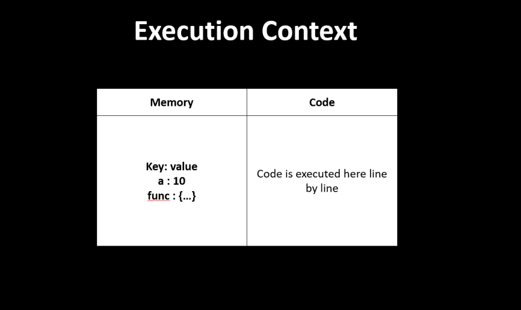
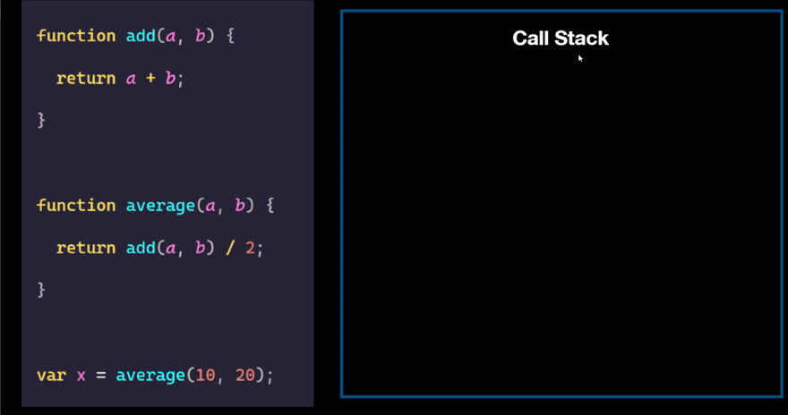
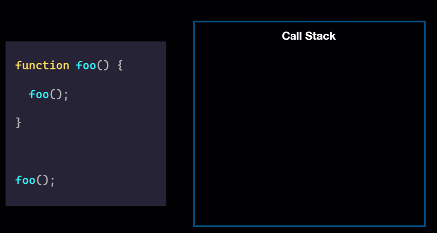

# How Javascript works ?

First let's see,

## What is JavaScript ?

**_"JavaScript is a [scripting or programming language](https://www.javatpoint.com/scripting-vs-programming) that allows you to enable interactive and dynamic web content. It is the third layer of the layer cake of standard web technologies, two of which (HTML and CSS). JavaScript is not only used by web browsers, also it can run in other environments such as Node.js._**

## The high-level vision of how JavaScript code is executed?

JavaScript execution follows a series of steps which include _parsing_, _compilation_, and _runtime execution_. Here's an overview of how JavaScript code is executed:

- **_Loading the script:_** When a web page containing JavaScript is loaded in the browser, the browser fetches the script, either embedded in the HTML file or referenced by a separate file with a `"<script>"` tag.

- **_Parsing:_** The browser parses the JavaScript code and builds an [abstract syntax tree (AST)](https://en.wikipedia.org/wiki/Abstract_syntax_tree) representing the structure of the code. During this phase, any _syntax errors_ in the code are detected, and the code execution stops in case of a syntax error.

- **_Compilation:_** Modern JavaScript engines, like _Google's V8_, use Just-In-Time (JIT) compilation to optimize the code for faster execution. The JavaScript engine compiles the JavaScript code into a lower-level, optimized machine code that the computer can execute more efficiently.

- **_Runtime execution:_** After the compilation, the JavaScript engine executes the machine code. During the execution, the code interacts with the Document Object Model (DOM) to manipulate web page elements, responds to user events, and can perform various tasks like making network requests, setting timeouts, or handling asynchronous code using callbacks, promises, or async/await.

- **_Garbage collection:_** JavaScript uses automatic garbage collection to free up memory that is no longer used by the program. When objects are no longer referenced, they become eligible for garbage collection, and the memory occupied by them is released.

## Now let's dive into the low-level vision of how JavaScript code is executed?

> "Everything in JavaScript happens inside an Execution Context."

But,

### What is Execution Context ?

The browser's JavaScript engine creates a special environment in which JavaScript code is executed. It includes all the variable, function, and object declarations, as well as the scope chain and the value of the "this" keyword at a particular point in time during the execution of a JavaScript program. This environment is known as the **_Execution Context._**

You can assume this Execution context to be a big container, invoked when the browser wants to run some JavaScript code.
In this container, there are two components **_1. Memory component_** **_2. Code component_**

**_1. Memory component_** : is also known as variable environment. In this memory component, variables and functions are stored as key-value pairs.

**_2. Code component_** : is a place in the container where `code is executed one line at a time`. This code component also has a fancy name, namely `'Thread of Execution'`.

<div align="center"></div>

Here are the three types of execution contexts in JavaScript:

**_1. Global Execution Context:_** The global execution context is created when the JavaScript engine starts executing the code. It is the default context and includes all the global variables and functions, including those defined by the browser and the user.

**_2. Functional Execution Context:_** Whenever a function is called, a new functional execution context is created. Each function has its own execution context, which includes the local variables, arguments, and any nested functions or inner functions defined inside the function.

**_3. Eval Execution Context:_** The eval execution context is created when the eval function is called to execute a string of JavaScript code in the current scope. It creates a new scope and introduces new variables and functions to that scope.

Each execution context has a creation and an execution phase.

- During the creation phase, the JavaScript engine scans the code and creates a lexical environment, which is a mapping of all the available identifiers and their respective values. It also creates the scope chain, which is a list of all the available variables and functions in the current context and its parent contexts.

- During the execution phase, the JavaScript engine executes the code line by line, assigning values to the variables and invoking functions as required.

The execution context also determines the value of the "this" keyword, which refers to the object that the current code is associated with. In the global context, "this" refers to the global object, while in a function context, it refers to the object that the function is called on.

`IMPORTANT 👉` See this example about Execution Context from [here](https://dev.to/narottam04/how-javascript-works-visually-explained-269j)

As we see above **_" the JavaScript engine executes the code line by line"_**, but why?
It is because JavaScript is a **_synchronous, single-threaded language_**. It is because it can only execute one command at a time and in a specific order.

But, How does execution context handle the execution (executes the code line by line)?

It handled it by **_Call stack_**, Let's see What is it and how it work.

#### Call Stack

**_The call stack is a data structure used by JavaScript to keep track of the execution context during the execution of a program. It is a LIFO (Last-In-First-Out) data structure, meaning that the most recently added execution context is the first one to be removed when the code is executed._**

Whenever a function is called in JavaScript, a new execution context is added to the top of the call stack. This happens during the creation phase of the function's execution context. The function's execution context includes information such as the function's arguments, local variables, and the value of the "this" keyword. When the function completes its execution, its execution context is removed from the call stack, and the control is returned to the previous execution context on the call stack.

Here's an example of how the call stack works:

```js
function add(a, b) {
  return a + b;
}

function average(a, b) {
  return add(a, b) / 2;
}

var x = average(10, 20);
```

When the above code is executed, the call stack will look something like this:

<div align="center"></div>

Here's what happens in each step:

1. The global execution context is added to the call stack.
2. The "average" function is called, which adds its execution context to the top of the call stack.
3. The "add" function is called, which adds its execution context to the top of the call stack.
4. The "return a + b" statement is executed, and the "add" function's execution context is removed from the call stack.
5. The "return add(a, b) / 2" statement is executed, and the "average" function's execution context is removed from the call stack.
6. The global execution context remains on the call stack, and the program terminates.

It's worth noting that if the call stack becomes too large, it can cause a _stack overflow error_, which occurs when there are too many nested function calls and the call stack runs out of memory.

<div align="center"></div>

<hr />

#### Resources

- [https://developer.mozilla.org/en-US/docs/Learn/JavaScript/First_steps/What_is_JavaScript](https://developer.mozilla.org/en-US/docs/Learn/JavaScript/First_steps/What_is_JavaScript)
- [https://dev.to/ejjraifihamza/javascript-call-stack-4e1c](https://dev.to/ejjraifihamza/javascript-call-stack-4e1c)
- [https://developer.mozilla.org/en-US/docs/Glossary/Call_stack](https://developer.mozilla.org/en-US/docs/Glossary/Call_stack)
- [https://dev.to/narottam04/how-javascript-works-visually-explained-269j](https://dev.to/narottam04/how-javascript-works-visually-explained-269j)
- [https://www.freecodecamp.org/news/how-javascript-works-behind-the-scene-javascript-execution-context/](https://www.freecodecamp.org/news/how-javascript-works-behind-the-scene-javascript-execution-context/)
- ChatGPT
