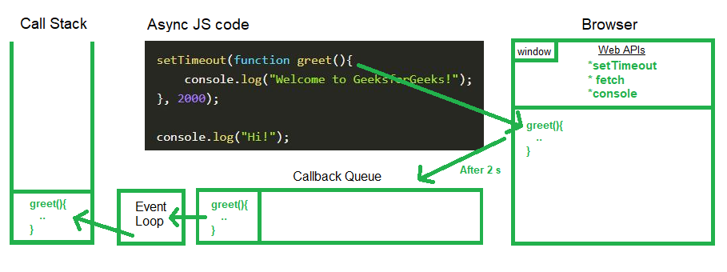

# Synchronous vs Asynchronous In Javascript

As we said before Javascript started as a **_single threaded synchronous language_**. 
A programming language which is supposed to run on a single thread means that this will be able to `do only one thing at a time`. Doing one thing at a time will require it to follow some order of execution. It is thus called _synchronous_.

But, What is the problem here ? let's see this example [A long-running synchronous function](https://developer.mozilla.org/en-US/docs/Learn/JavaScript/Asynchronous/Introducing#a_long-running_synchronous_function)

when JavaScript executes a _long-running synchronous code_ the problem here is the main thread will `blocked` as we see in the above example .. JavaScript runs on the browser’s main thread by default, so _the entire UI is stuck or frozen_ and no one wants a slow, unresponsive website.

So, How Javascript solve this problem ?

JavaScript solves the problem of blocking the main thread by using **_Asynchronous Programming_**. 
I will discuss this topic in the [Asynchronous Javascript](https://github.com/omar1Mayallo/Practical-Javascript/tree/main/3-%20Asynchronous%20Javascript). 
Asynchronous programming allows the main thread to continue executing `(non-blocking)` while an asynchronous operation is in progress. This means that the _user interface can remain responsive and the application can feel faster_.

We discuss how JavaScript executes a synchronous code line by line in [How Javascript works](https://github.com/omar1Mayallo/Practical-Javascript/tree/main/1-%20How%20Javascript%20works). So let's see how javascript handle asynchronous code.

## Asynchronous in JavaScript

As we saw above, JavaScript code execution happens in the **_call stack_**. However, there are other parts that help JavaScript execute _asynchronous_ code, such as the **_event loop_** and the **_callback queue_**.

- **_The event loop_** ⇒ is responsible for managing the execution of JavaScript code. It does this by taking code from the call stack and executing it until the call stack is empty. When the call stack is empty, the event loop checks the callback queue to see if there are any callbacks that need to be executed. If there are, the event loop will execute the next callback and then continue checking the call stack.

- **_The callback queue_** ⇒ is a list of callbacks that need to be executed. Callbacks are functions that are executed when an asynchronous event completes. For example, a callback might be executed when a network request completes or when a user input event occurs.

The event loop and the callback queue work together to allow JavaScript code to execute asynchronously. This means that JavaScript code can continue to run even when it is waiting for an asynchronous event to complete. This is important for making JavaScript applications responsive and efficient.

`Important ➡` [JavaScript Visualized: Event Loop](https://dev.to/lydiahallie/javascript-visualized-event-loop-3dif) it's an awesome example to see how asynchronous execution in JavaScript.

`Test it live ➡` [Test asynchronous execution in JavaScript](http://latentflip.com/loupe/?code=JC5vbignYnV0dG9uJywgJ2NsaWNrJywgZnVuY3Rpb24gb25DbGljaygpIHsKICAgIHNldFRpbWVvdXQoZnVuY3Rpb24gdGltZXIoKSB7CiAgICAgICAgY29uc29sZS5sb2coJ1lvdSBjbGlja2VkIHRoZSBidXR0b24hJyk7ICAgIAogICAgfSwgMjAwMCk7Cn0pOwoKY29uc29sZS5sb2coIkhpISIpOwoKc2V0VGltZW91dChmdW5jdGlvbiB0aW1lb3V0KCkgewogICAgY29uc29sZS5sb2coIkNsaWNrIHRoZSBidXR0b24hIik7Cn0sIDUwMDApOwoKY29uc29sZS5sb2coIldlbGNvbWUgdG8gbG91cGUuIik7!!!PGJ1dHRvbj5DbGljayBtZSE8L2J1dHRvbj4%3D)

#### Resources

- [https://developer.mozilla.org/en-US/docs/Web/JavaScript/Event_loop](https://developer.mozilla.org/en-US/docs/Web/JavaScript/Event_loop)
- [https://www.geeksforgeeks.org/what-is-an-event-loop-in-javascript/](https://www.geeksforgeeks.org/what-is-an-event-loop-in-javascript/)
- [https://www.scaler.com/topics/javascript/event-loop-in-javascript/](https://www.scaler.com/topics/javascript/event-loop-in-javascript/)
- [https://dev.to/lydiahallie/javascript-visualized-event-loop-3dif](https://dev.to/lydiahallie/javascript-visualized-event-loop-3dif)
- [https://www.geeksforgeeks.org/why-javascript-is-a-single-thread-language-that-can-be-non-blocking/](https://www.geeksforgeeks.org/why-javascript-is-a-single-thread-language-that-can-be-non-blocking/)
- [https://medium.com/swlh/what-does-it-mean-by-javascript-is-single-threaded-language-f4130645d8a9](https://medium.com/swlh/what-does-it-mean-by-javascript-is-single-threaded-language-f4130645d8a9)
- [https://dev.to/bbarbour/if-javascript-is-single-threaded-how-is-it-asynchronous-56gd](https://dev.to/bbarbour/if-javascript-is-single-threaded-how-is-it-asynchronous-56gd)
- [http://latentflip.com/loupe/?code=JC5vbignYnV0dG9uJywgJ2NsaWNrJywgZnVuY3Rpb24gb25DbGljaygpIHsKICAgIHNldFRpbWVvdXQoZnVuY3Rpb24gdGltZXIoKSB7CiAgICAgICAgY29uc29sZS5sb2coJ1lvdSBjbGlja2VkIHRoZSBidXR0b24hJyk7ICAgIAogICAgfSwgMjAwMCk7Cn0pOwoKY29uc29sZS5sb2coIkhpISIpOwoKc2V0VGltZW91dChmdW5jdGlvbiB0aW1lb3V0KCkgewogICAgY29uc29sZS5sb2coIkNsaWNrIHRoZSBidXR0b24hIik7Cn0sIDUwMDApOwoKY29uc29sZS5sb2coIldlbGNvbWUgdG8gbG91cGUuIik7!!!PGJ1dHRvbj5DbGljayBtZSE8L2J1dHRvbj4%3D](http://latentflip.com/loupe/?code=JC5vbignYnV0dG9uJywgJ2NsaWNrJywgZnVuY3Rpb24gb25DbGljaygpIHsKICAgIHNldFRpbWVvdXQoZnVuY3Rpb24gdGltZXIoKSB7CiAgICAgICAgY29uc29sZS5sb2coJ1lvdSBjbGlja2VkIHRoZSBidXR0b24hJyk7ICAgIAogICAgfSwgMjAwMCk7Cn0pOwoKY29uc29sZS5sb2coIkhpISIpOwoKc2V0VGltZW91dChmdW5jdGlvbiB0aW1lb3V0KCkgewogICAgY29uc29sZS5sb2coIkNsaWNrIHRoZSBidXR0b24hIik7Cn0sIDUwMDApOwoKY29uc29sZS5sb2coIldlbGNvbWUgdG8gbG91cGUuIik7!!!PGJ1dHRvbj5DbGljayBtZSE8L2J1dHRvbj4%3D)
