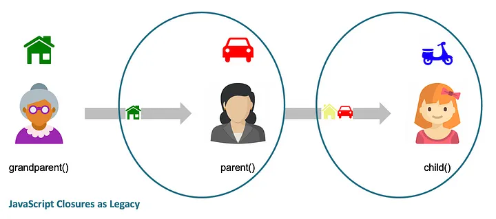

# Closure

> [MDN](https://developer.mozilla.org/en-US/docs/Web/JavaScript/Closures) : A closure is the combination of a function bundled together (enclosed) with references to its surrounding state (the lexical environment). In other words, a closure gives you access to an outer function's scope from an inner function. _In JavaScript, closures are created every time a function is created, at function creation time_.

The closure has three scope chains:

- it has access to its **_own scope_** — variables defined between its curly brackets
- it has access to the **_outer function’s variables_**
- it has access to the **_global variables_**

## Example

Let's see the following example to see how the closure works:

```javascript
function grandParent() {
  var house = "GreenHouse";
  // console.log('I have:', house, car, scooter);
  function parent() {
    var car = "Tesla";
    house = "YellowHouse";
    // console.log('I have:', house, car, scooter);
    function child() {
      var scooter = "Vespa";
      console.log("I have:", house, car, scooter);
    }

    return child;
  }

  return parent;
}
grandParent(); // if commented out console.log() >> ReferenceError: car is not defined
grandParent()(); // if commented out console.log() >> ReferenceError: scooter is not defined
grandParent()()(); // I have: YellowHouse Tesla Vespa
```

To understand the previous example see this image below 👇 :

<div align="center"></div>

## Why closures exists ?

**_Closures_** exist in JavaScript due to the language's lexical scoping and the ability to create functions inside other functions. Closures provide an elegant way to _encapsulate data_ and _create private variables_, _allowing for data privacy_ and _the preservation of state_.

## Some use cases

- **_Data Privacy_**

  Closures are useful for creating private variables and functions. By defining variables within a closure, they are not accessible outside of the closure, providing data privacy.

  ```javascript
  function createPerson(name) {
    let age = 0;

    function getAge() {
      return age;
    }

    function increaseAge() {
      age++;
    }

    return {
      getName: () => name,
      getAge,
      increaseAge,
    };
  }

  const person = createPerson("John");
  console.log(person.getName()); // Output: John
  console.log(person.getAge()); // Output: 0

  person.increaseAge();
  console.log(person.getAge()); // Output: 1
  ```

  In this example, the `createPerson` function encapsulates the `age` variable within its scope. The returned object has access to the `name` variable and can manipulate the `age` variable while keeping it private. This provides data privacy and prevents direct access to the `age` variable from outside the closure.

<div align="center">______________</div><br>

- **_Module Pattern_**

  Closures can be used to create modules, which are self-contained units of code. The module pattern allows you to expose only the necessary functions and variables while keeping others private.

  ```javascript
  const counterModule = (function () {
    let count = 0;

    function increment() {
      count++;
    }

    function decrement() {
      count--;
    }

    function getCount() {
      return count;
    }

    return {
      increment,
      decrement,
      getCount,
    };
  })();

  console.log(counterModule.getCount()); // Output: 0

  counterModule.increment();
  counterModule.increment();
  console.log(counterModule.getCount()); // Output: 2

  counterModule.decrement();
  console.log(counterModule.getCount()); // Output: 1
  ```

  In this example, an [immediately invoked function expression (IIFE)](https://developer.mozilla.org/en-US/docs/Glossary/IIFE) is used to create a module that maintains its own private state (`count`). The returned object exposes only the necessary functions to manipulate and retrieve the `count` value, effectively creating a module with data encapsulation and controlled access.

<div align="center">______________</div><br>

- **_Asynchronous Operations_**

  Closures are often used in asynchronous operations, such as callbacks and event handlers. They help in preserving the context and accessing variables when the callback is invoked.

  ```javascript
  function fetchData(url) {
    return function (callback) {
      setTimeout(() => {
        const data = {name: "John", age: 30};
        callback(data);
      }, 2000);
    };
  }

  const getData = fetchData("https://api.example.com/data");

  getData(function (result) {
    console.log(result); // Output: { name: 'John', age: 30 }
  });
  ```

  In this example, the `fetchData` function returns a closure that takes a callback function. Inside the closure, an asynchronous operation (e.g., fetching data from an API) is simulated using `setTimeout`. Once the operation completes, the callback is invoked with the fetched data. The closure preserves the necessary variables (`url`, in this case) to perform the asynchronous operation and deliver the result.

<div align="center">______________</div><br>

**_The closure is a main concept in javascript and is widely used in all javascript projects, libraries, and frameworks (React, Next, Node, ...etc)._**

<div align="center">______________</div><br>

<hr />

### Resources

- [https://developer.mozilla.org/en-US/docs/Web/JavaScript/Closures](https://developer.mozilla.org/en-US/docs/Web/JavaScript/Closures)
- [https://medium.com/javascript-scene/master-the-javascript-interview-what-is-a-closure-b2f0d2152b36](https://medium.com/javascript-scene/master-the-javascript-interview-what-is-a-closure-b2f0d2152b36)
- [https://www.javascripttutorial.net/javascript-closure/](https://www.javascripttutorial.net/javascript-closure/)
- [https://medium.com/swlh/javascript-closures-simplified-262d935466ec](https://medium.com/swlh/javascript-closures-simplified-262d935466ec)
