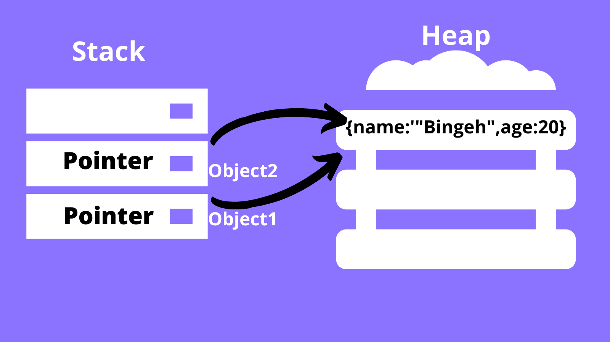

# Types In Javascript

In JavaScript, there are two main categories of types: `primitive types` (also known as value types) and `reference types`. Let's explore the differences between them:

## Primitive Types (value types)

- Primitive types include: `number`, `string`, `boolean`, `null`, `undefined`, and `symbol`.

- They are called `value types` because their values are directly assigned and stored in variables.

```javascript
let num1 = 5;
let num2 = num1;

num1 = 7;
console.log(num2); // 5
```

```javascript
let number = 10;
function increase(number) {
  number++;
  console.log(number); // 11
}
increase(number);
console.log(number); // 10
```

From the above examples ... This behavior occurs because `primitive types`, such as `numbers`, are assigned and copied by value in JavaScript. When you assign a `primitive` value to a new variable or pass it as an argument, a new copy of the value is created. Modifying one copy doesn't affect the other copies.

## Reference Types

- Reference types include: `object`, `array`, `function`, and `date`.

  > JavaScript considers array, function, and date are objects so we can consider types as primitive types and object types.

- They are called `reference types` because variables of reference types store references `(memory addresses)` to the actual objects in memory.

```javascript
let obj1 = {name: "John"};
let obj2 = obj1;

obj1.name = "Mark";
console.log(obj2); // { name: 'Mark' }
```

```javascript
let numObj = {value: 1};
function increase(numObj) {
  numObj.value++;
  console.log(numObj); // { value: 2 }
}
increase(numObj);
console.log(numObj); // { value: 2 }
```

When assigning a reference type to a new variable or passing it as an argument to a function, the `reference` to the object is copied, not the actual object. Both variables then point to the same object `in memory`.

<div align="center"></div>

Modifying the object through one variable will affect the object accessed through other variables since they refer to the same object.

<hr/>

### Summary

- **_Primitive types are copied by their values._**

- **_Reference types are copied by their references._**
