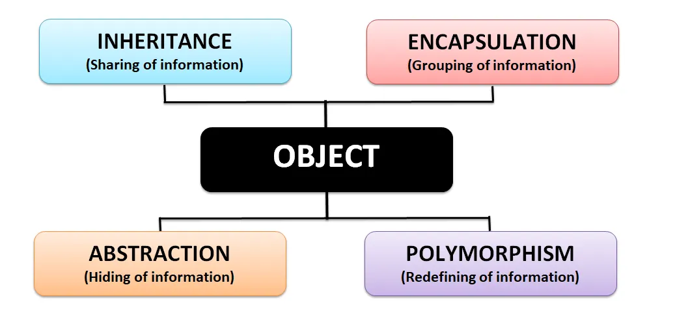
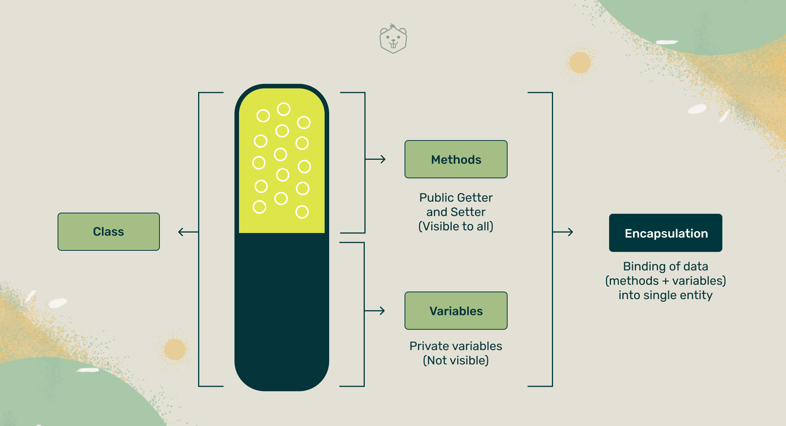
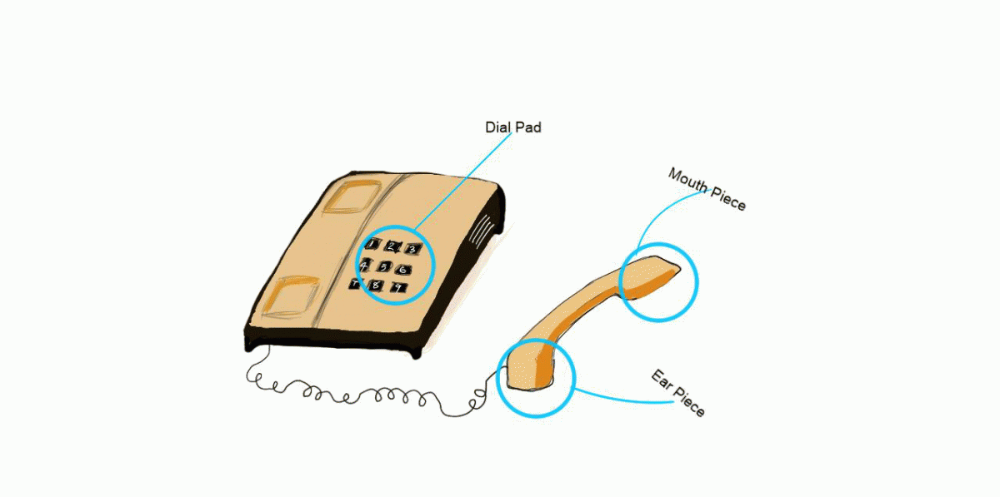
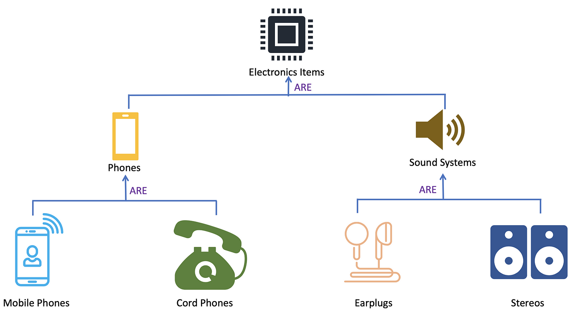
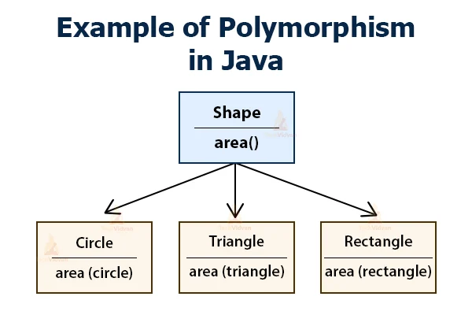

# Object-Oriented Programming (OOP) in JavaScript

**_Object-Oriented Programming (OOP)_** is a popular paradigm in the programming world and is based on the concept of **_“objects”_**. It organizes code into self-contained units (objects) that have their own properties and methods, enabling developers to model real-world entities and their interactions effectively.

As a paradigm, it provides a style of writing and organizing code that aims to make it more readable, testable, maintainable, and reusable. To achieve these goals, OOP follows four core principles, commonly referred to as the _“Four Pillars”_: **_Encapsulation_**, **_Abstraction_**, **_Inheritance_**, and **_Polymorphism_**.

<div align="center"></div>

## OOP Pillars

### 1- Encapsulation

Encapsulation is achieved when each object keeps its _state private_, inside a class. Other objects don’t have direct access to this state. Instead, they can only call a list of public functions — called methods.

<div align="center">
  
</div><br/>

You Can think of Encapsulation as an actual **_capsule_**. A single capsule can contain a variety of powders and chemicals that work together as a single unit.

But, Why do we need Encapsulation? Let's see an awesome example of a deep understanding of the Encapsulation concept:

<br/>

<div align="center">
  
</div>

```js
class Cat {
  #mood = "happy"; // Private field (using # symbol)
  #hungry = true; // Private field (using # symbol)
  #energy = 100; // Private field (using # symbol)

  // Private method (using # symbol) to meow
  #meow() {
    console.log("Meow!");
  }

  // Public method to feed the cat
  feed() {
    if (this.#hungry) {
      console.log("Nom nom nom...");
      this.#hungry = false;
    } else {
      console.log("The cat is not hungry.");
    }
    this.#meow(); // May invoke meow()
  }

  // Public method to play with the cat
  play() {
    console.log("Playing with the cat!");
    this.#mood = "happy";
    this.#energy -= 20;
    this.#meow(); // May invoke meow()
  }

  // Public method to let the cat sleep
  sleep() {
    console.log("Zzzzz...");
    this.#energy = 100;
    this.#meow(); // May invoke meow()
  }

  // Public method to get the cat's current mood
  getMood() {
    return this.#mood;
  }

  // Public method to get the cat's hunger status
  isHungry() {
    return this.#hungry;
  }

  // Public method to get the cat's energy level
  getEnergy() {
    return this.#energy;
  }
}

// Example usage:
const myCat = new Cat();

console.log("Initial Mood:", myCat.getMood()); // Output: Initial Mood: happy
console.log("Is Hungry?", myCat.isHungry()); // Output: Is Hungry? true
console.log("Energy Level:", myCat.getEnergy()); // Output: Energy Level: 100

myCat.feed(); // Output: Nom nom nom... Meow!
console.log("Is Hungry?", myCat.isHungry()); // Output: Is Hungry? false

myCat.play(); // Output: Playing with the cat! Meow!
console.log("Energy Level:", myCat.getEnergy()); // Output: Energy Level: 80

myCat.sleep(); // Output: Zzzzz... Meow!
console.log("Energy Level:", myCat.getEnergy()); // Output: Energy Level: 100
```

Cat class has:

- **_Private state_**: `mood`, `hungry`, `energy` (properties), and `meow` (method).

  - The private state can call just inside the `Cat` class.
  - The other classes can't access these directly .. for example, we can’t tell the cat when to meow.
  - This is the mean of **_Encapsulation_**.<br/><br/>

  ```js
  myCat.#meow;
  // SyntaxError: Private field '#meow' must be declared in an enclosing class
  ```

- **_Public Methods_**: `feed`, `play`, `sleep`, `getMood`, `isHungry`, `getEnergy` (methods).

  - The public methods used to access the private state and update them from other classes.
  - for example, here we call the `play` method which implements a logic to update `mood`, and `energy` (private properties) and invoke `meow` (private method).<br/><br/>

  ```js
  myCat.play(); // Output: Playing with the cat! Meow!
  console.log("Energy Level:", myCat.getEnergy()); // Output: Energy Level: 80
  ```

<br>

**_So, with Encapsulation we want to group or bind related functions and properties that address a specific functionality _(like a headache capsule)_ into a single piece of code that we can call or reuse throughout the program. and we want to hide these grouped functionalities from interference that may come from outside._**

<hr>

### 2- Abstraction

Abstraction shows only what is necessary for the user to interact with the object while hiding the implementation details.

<div align="center">
  
</div>

**_It's like Encapsulation ?!_**

Almost true, we can think of Abstraction as a natural extension of encapsulation. but let's see the difference between them :

<div align="center">
  
</div>

- **_Encapsulation_**: Encapsulation is primarily about bundling data (properties) and methods (functions) together within a single unit (object), and controlling access to the internal state. It ensures that the implementation details are hidden from external code, promoting security and well-structured code.

- **_Abstraction_**: Abstraction, on the other hand, focuses on providing a simplified and high-level view of an object's functionality. It abstracts away the implementation details, allowing users to interact with the object using only relevant methods and properties, without being concerned about the internal complexities.

**_So they are different concepts because `the goals of each of them are different`: Encapsulation ensures data privacy and controlled access, while Abstraction simplifies the interface and presents a clean and clear view of the object's behavior._**

let's show example to understand the Abstraction concept:

When driving a car, we, as users, are only interested in performing actions like moving and braking. We don't need to know the intricate details of the engine's internal combustion process or how the oil brake system works.

_This is exactly what Abstraction achieves showing only the important actions to the user while concealing the implementation complexity._

```js
class Car {
  // Private method for internal combustion (hidden from direct access)
  #_internalCombustion() {
    console.log("Vroom! Vroom! Internal combustion engine running.");
    // ... Implementation of internal combustion process ...
  }

  // Private method for oil brake action (hidden from direct access)
  #_oilBrakeAction() {
    console.log("Applying oil brake for braking.");
    // ... Implementation of the oil brake system ...
  }

  // Public method to move the car (using the internal combustion engine)
  move() {
    console.log("Car is moving.");
    this.#_internalCombustion(); // Calling the private method for engine operation
    // ... Implementation of car movement ...
  }

  // Public method for braking the car (using the oil brake system)
  brake() {
    console.log("Car is braking.");
    this.#_oilBrakeAction(); // Calling the private method for brake action
    // ... Implementation of braking process ...
  }
}

// Example usage:
const myCar = new Car();
myCar.move(); // Output: Car is moving. Vroom! Vroom! Internal combustion engine running.
myCar.brake(); // Output: Car is braking. Applying oil brake for braking.
```

<hr>

### 3- Inheritance

Inheritance is a fundamental concept in Object-Oriented Programming (OOP) that allows a class (subclass) to inherit properties and behaviors from another class (superclass). It is a way of creating a hierarchy of classes with shared characteristics and functionalities.

<div align="center">
  
</div>

Let's show example to understand the Inheritance concept:

```js
// Base class (Superclass)
class Animal {
  constructor(name, age) {
    this.name = name;
    this.age = age;
  }

  // Method in the superclass
  makeSound() {
    console.log("Some generic animal sound.");
  }
}

// Subclass (extends Animal)
class Dog extends Animal {
  // Additional property specific to Dog class
  constructor(name, age, breed) {
    super(name, age);
    this.breed = breed;
  }

  // Overriding the makeSound method with a specific implementation for Dog
  makeSound() {
    console.log("Woof! Woof!");
  }

  // Additional method specific to Dog class
  fetch() {
    console.log("Fetching the ball!");
  }
}

// Creating instances of the classes
const genericAnimal = new Animal("Generic Animal", 5);
const myDog = new Dog("Buddy", 3, "Golden Retriever");

// Using methods from the superclass and subclass
genericAnimal.makeSound(); // Output: Some generic animal sound.
myDog.makeSound(); // Output: Woof! Woof!
myDog.fetch(); // Output: Fetching the ball!
```

<hr>

### 4- Polymorphism

Polymorphism means **_“many shapes”_** in Greek. Polymorphism means one name and many forms. But, why it's important concept of OOP ?

<div align="center">
  
</div>

So we already know the power of inheritance and happily use it. But there comes this problem.

Say we have a parent class and a few child classes which inherit from it. Sometimes we want to use a collection — for example a list — which contains a mix of all these classes. Or we have a method implemented for the parent class — but we’d like to use it for the children, too.

This can be solved by using Polymorphism.

Here are two examples that demonstrate the use of polymorphism:

**Example 1: Shape Hierarchy**

Let's consider a simple shape hierarchy with a base class `Shape` and two subclasses `Circle` and `Rectangle`. Each shape has a method to calculate its area. We want to have a collection of shapes and calculate the total area for all shapes in the collection, regardless of their specific type.

```javascript
class Shape {
  calculateArea() {
    return 0; // Base class implementation (to be overridden by subclasses)
  }
}

class Circle extends Shape {
  constructor(radius) {
    super();
    this.radius = radius;
  }

  calculateArea() {
    return Math.PI * this.radius ** 2;
  }
}

class Rectangle extends Shape {
  constructor(width, height) {
    super();
    this.width = width;
    this.height = height;
  }

  calculateArea() {
    return this.width * this.height;
  }
}

// Create an array of different shapes
const shapes = [
  new Circle(5),
  new Rectangle(4, 6),
  new Circle(3),
  new Rectangle(5, 10),
];

// Calculate the total area for all shapes in the array
let totalArea = 0;
shapes.forEach((shape) => {
  totalArea += shape.calculateArea();
});

console.log("Total area of all shapes:", totalArea);
```

In this example, we have a collection `shapes` that contains instances of both `Circle` and `Rectangle` classes. We can call the `calculateArea()` method for each shape in the collection without worrying about their specific types. Polymorphism allows us to treat all shapes as instances of the base class `Shape`, and the appropriate implementation of the `calculateArea()` method is called based on the actual type of each shape at runtime.

**Example 2: Virtual Pet Game**

Consider a virtual pet game with a base class `Pet` and two subclasses `Dog` and `Cat`. All pets have a common method `makeSound()`, but each pet type makes a different sound. We want to have a function that takes a pet as an argument and calls the `makeSound()` method, regardless of whether it's a `Dog`, a `Cat`, or any other future pet type.

```javascript
class Pet {
  makeSound() {
    console.log("Some generic pet sound.");
  }
}

class Dog extends Pet {
  makeSound() {
    console.log("Woof! Woof!");
  }
}

class Cat extends Pet {
  makeSound() {
    console.log("Meow!");
  }
}

function playWithPet(pet) {
  pet.makeSound(); // Calls the appropriate makeSound() method based on the pet type
}

const myDog = new Dog();
const myCat = new Cat();

playWithPet(myDog); // Output: Woof! Woof!
playWithPet(myCat); // Output: Meow!
```

In this example, the function `playWithPet()` takes a `pet` object as an argument and calls the `makeSound()` method on that object. Regardless of whether `pet` is a `Dog` or a `Cat`, polymorphism allows us to invoke the appropriate `makeSound()` method based on the actual type of the `pet` object at runtime.

<hr>

## Summary

**_OOP is a programming paradigm that focuses on organizing code into objects, each representing a distinct entity with its characteristics (properties) and behaviors (methods). These objects can interact with each other to perform tasks and represent complex systems._**

**Advantages of using OOP**

1. **Code Reusability**: OOP encourages the creation of reusable code by using inheritance and creating objects that can be used in different parts of the application.

2. **Modularity**: Objects encapsulate data and behavior, providing a modular approach to programming. This modular design makes it easier to maintain and extend the codebase.

3. **Easy to Understand**: OOP promotes abstraction, allowing developers to create models that closely resemble real-world entities. This makes the code more intuitive and easier to understand for other developers.

4. **Organized and Maintainable Code**: By following the principles of OOP, the codebase can be structured in a logical and organized manner, making it easier to maintain and debug.

5. **Security**: Encapsulation helps in securing data by controlling access to the object's properties. It limits direct manipulation and ensures data integrity.

<hr>

#### Resources

- [https://medium.com/swlh/the-four-pillars-of-object-oriented-programming-87a2a98d39db](https://medium.com/swlh/the-four-pillars-of-object-oriented-programming-87a2a98d39db)
- [https://medium.com/@simba3310/learn-the-four-pillars-of-object-oriented-programming-oop-f2358e1aa623](https://medium.com/@simba3310/learn-the-four-pillars-of-object-oriented-programming-oop-f2358e1aa623)
- [https://www.freecodecamp.org/news/object-oriented-programming-concepts-21bb035f7260](https://www.freecodecamp.org/news/object-oriented-programming-concepts-21bb035f7260)
- [https://developer.mozilla.org/en-US/docs/Web/JavaScript/Reference/Classes/Private_class_fields](https://developer.mozilla.org/en-US/docs/Web/JavaScript/Reference/Classes/Private_class_fields)
